# Basic Git Command

## ai-Startup-Website

## Collaborative Website Development With Git and GitHub.

Part 1: Set-Up and Initial Configuration

**Install git** :To install Git on your Windows machine, follow these steps:

1. **Download Git**: Go to the [Git for Windows download page](https://git-scm.com/downloads/win) and click on the "Download" button to get the latest version of Git for Windows.

2. **Run the Installer**: Once the download is complete, open the installer file. Follow the prompts in the Git Setup wizard to complete the installation.

3. **Select Installation Options**: During the installation, you'll be asked to choose between using Git from the Windows Command Prompt or using Git Bash, a Unix-style command-line interface. You can choose either option based on your preference.

4. **Complete the Installation**: Follow the rest of the prompts to finish the installation process.

5. **Verify Installation**: Open Git Bash or the Command Prompt and type:
   ```bash
   git --version
   ```
   This command will display the installed Git version, confirming that Git is successfully installed on your system.


**Create a GITHUB Repository**

Creating a GitHub repository after setting up your account is a straightforward process. Here’s how you can do it:

### Steps to Create a GitHub Repository:

1. **Log in to GitHub**:
   - Go to [github.com](https://github.com/) and log in with your account credentials.

2. **Create a New Repository**:
   - Click on the **+** icon in the upper-right corner of the page and select **New repository**.

   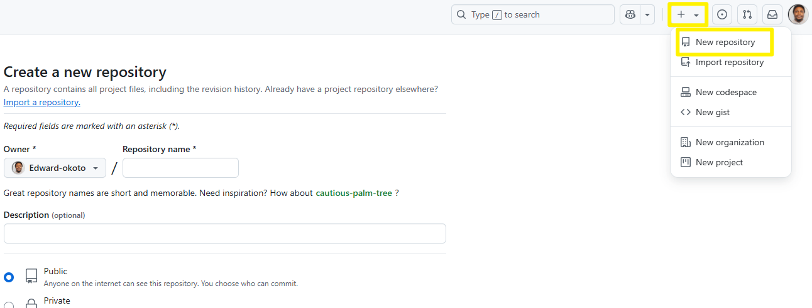

3. **Set Repository Details**:
   - **Repository name**: Enter a name for your repository (e.g., `my-new-repo`).
   - **Description**: Optionally, add a short description of your project.
   - **Public/Private**: Choose whether you want your repository to be public (visible to everyone) or private (only accessible to you and specific collaborators).
   - **Initialize with a README**: Check this box to add a README file, which is a good practice for documenting your project.

   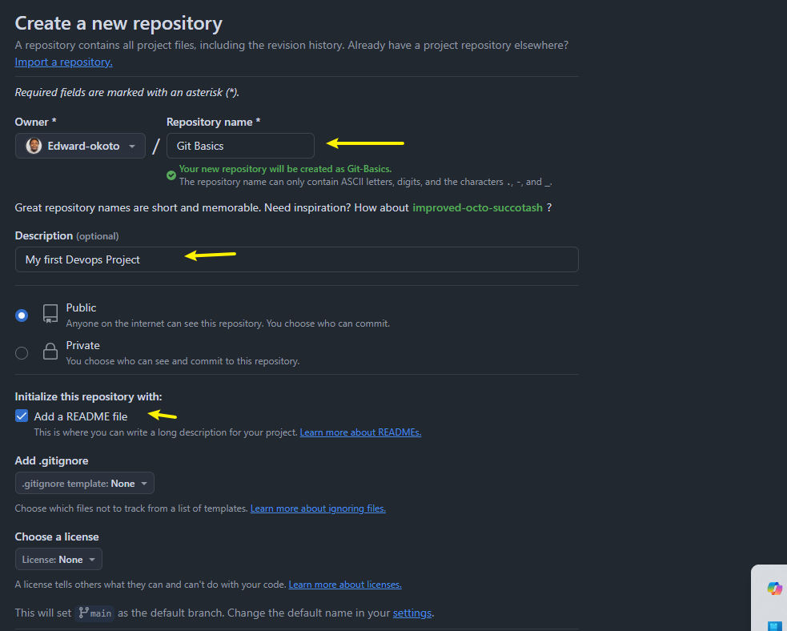

4. **Create Repository**:
   - Click the **Create repository** button.

### Clone the Repository:

To clone a repository from GitHub, follow these simple steps:

### Steps to Clone a GitHub Repository:

1. **Copy the Repository URL**:
   - Go to the repository page on GitHub.
   - Click on the green **Code** button.
   - Copy the URL provided (either HTTPS or SSH).

   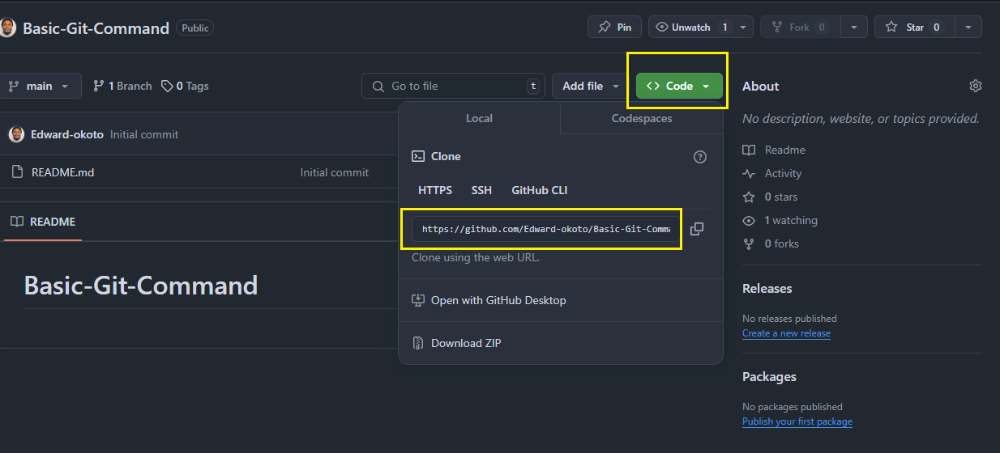

2. **Open Terminal**: Open Git Bash or your terminal.

3. **Navigate to Your Desired Directory**: Use the `cd` command to navigate to the directory where you want to clone the repository.
   ```bash
   cd path/to/your/directory
   ```

4. **Clone the Repository**: Use the `git clone` command followed by the repository URL.
   ```bash
   git clone https://github.com/Edward-okoto/Basic-Git-Command.git
   ```
   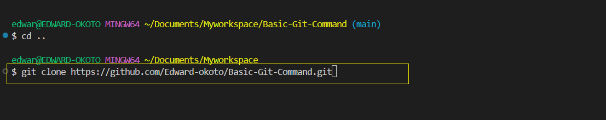

5. Navigate into the repo you cloned.

         cd Basit-Git-Command
6. Create an empty file named `index.html` and add this content
   to the file "This is the Admin creating an index.html file for Tom and Jerry.
"
 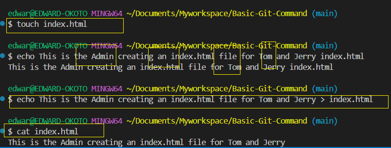 

7. Check changes has not been staged.

         
       git status
   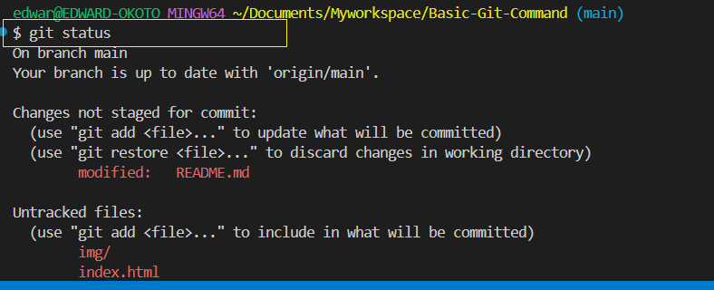 

8. Stage changes

       git add index.html
    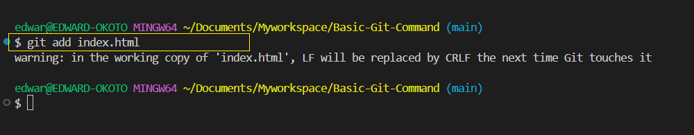 

9. Confirm changes have been staged for commit.

         
       git status
   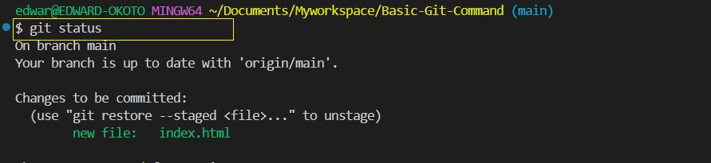

10. Commit changes

         git commit -m 'Header changes to index file'

    git commit takes the staged changes and records them in the 
   repositories history with a message on what was done.

11. Push main branch to Git Hub

          git push


SIMULATING TOM and JERRY'S WORK.

We would simulate tom and jerrys work by creating TWO(2) since we 
are working with same laptop.You will switch between the branches making
changes as each character.

TOMS WORK.

1.Navigate to the project repository

      cd Basic-Git-Command
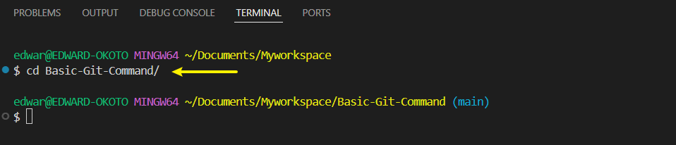

This moves Tom to a folder containing the cloned repository on your
local machine.Its like stepping into the projects workspace.

2 Check the current branch by command `git branch`.This shows you the list of 
all branches in your local repository.
INITIALLY,only the main branch exist,because thats the default starting point and no other
branch has been created.

      git branch
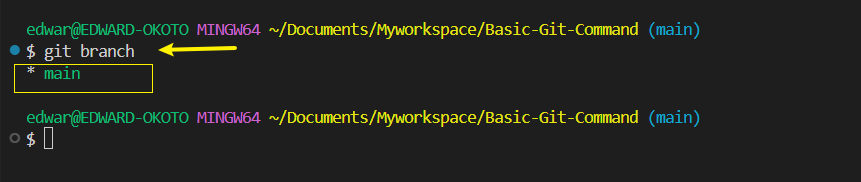

3 Create a BRANCH for TOMS work.

      git checkout -b update-navigation

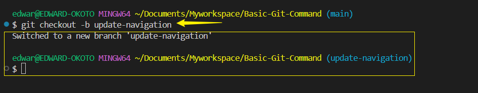
This creates a new branch named `update-navigation` and switches it
automatically to the new branch from the `main` branch.This branch
`update-navigation` is where we simulate TOMS contribution to the Website
without affecting whatever is in the main branch.

4 Check the list of branch again.

      git branch
   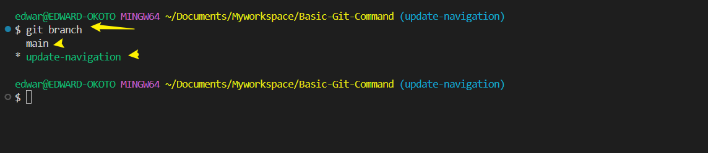

Running `git branch` again now shows your newly created branch,indicating
you are now working in this new `workspace`dedicated to TOMS updates.All files
from the main also exist in TOMS new workspace.

5 TOMS Adds content to the index.html file

      This is Tom adding Navigation to the AI-website
   
   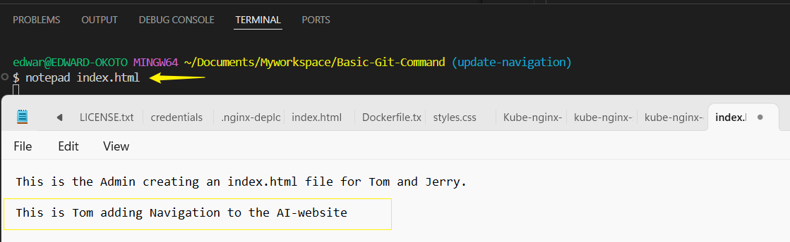

6.Check the status

      git status

 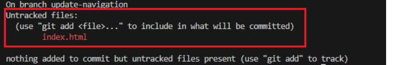

 At this stage TOM has modified the file,but these changes haven't
 been prepared for a commit in git.This is indicated by the file appearing in red indicating 
 the changes are recognized by git but not yet staged.

 7 Stage TOMS changes

      git add index.html

   This tells Git that TOM wants to include the updates made to `index.html`
   in the next commit.

 8 Confirm changes have been staged for commit.

      git status
 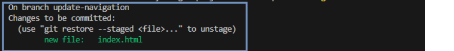
   
9 Commit changes.

      git commit -m "Update navigation bar"
This takes the staged changes and record them in the repostory history
with a message describing what was done.

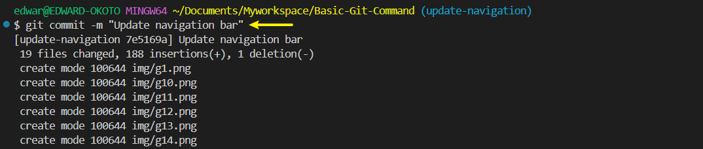

10 Push TOMS work to GITHUB

      git push origin update-navigation
